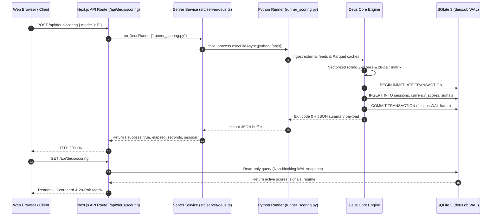

# DEUS PLATFORM: SYSTEM ARCHITECTURE SPECIFICATION

> **Software Design Description structured following IEEE 1016 conventions**

---

## 1. Architectural Philosophy and Design Principles

The **Deus Platform** is architected as an integrated quantitative macro oracle and execution analytics ecosystem. It unites statistical macroeconomic signal generation across the G8 currency universe and benchmark equity indices with institutional trade journaling, execution auditing, and prop firm risk tracking.

```
       ┌────────────────────────────────────────────────────────┐
       │                External Ingestion Sources              │
       │    (FRED API, Yahoo Finance, SDMX, CFTC, Gemini RSS)   │
       └───────────────────────────┬────────────────────────────┘
                                   │
                                   ▼
       ┌────────────────────────────────────────────────────────┐
       │     Python Deus Core Engine (packages/deus-engine)     │
       │  • Frequency-Adaptive Rolling Z-Scores                 │
       │  • CurrencyScorer & CycleBlender                       │
       │  • 28-Pair Combinatorial Cross Matrix                  │
       │  • Gemini 3.1 Transducer & VADER Circuit Breaker       │
       │  • Volatility / ATR Position Sizer                     │
       └───────────────────────────┬────────────────────────────┘
                                   │
                                   ▼ (IPC via ACID Transactions)
       ┌────────────────────────────────────────────────────────┐
       │         Shared SQLite 3 WAL Storage (deus.db)          │
       │     WAL Mode • Synchronous NORMAL • Timeout 15000ms     │
       └───────────────────────────┬────────────────────────────┘
                                   │
                                   ▼
       ┌────────────────────────────────────────────────────────┐
       │        Full-Stack Web Hub (apps/web - Next.js 15)      │
       │  ┌──────────────────────────┐┌───────────────────────┐ │
       │  │ Proprietary /deus Module ││ LuxAlgo Trade Journal │ │
       │  │ • Scores & Signals       ││ • Trade Logging       │ │
       │  │ • Gemini Intelligence    ││ • Calendar & Replay   │ │
       │  │ • Manual Sizer & Config  ││ • Importers (MT4/5)   │ │
       │  │ • Macro QA Engine        ││ • Prop Firm Tracker   │ │
       │  │ • Historical Audits      ││ • Risk Analytics      │ │
       │  └──────────────────────────┘└───────────────────────┘ │
       └────────────────────────────────────────────────────────┘
```

The system is governed by four core architectural principles:
1. **Unidirectional Dependency and State Flow:** Information progresses systematically from data ingestion, through normalization and cyclical scoring, to cross-sectional matrix evaluation, and finally to shared SQLite persistence. Presentation and analytics layers (Next.js web hub, Telegram daemon) consume calculated state and execute isolated transactional queries.
2. **Strict Decoupling of Signal Oracle and Execution:** The quantitative core operates as a statistical data oracle without live broker execution dependencies. Position sizing calculators and prop firm risk tracking parameters enforce capital allocation guardrails as separate, deterministic analytical utilities.
3. **Point-in-Time Determinism & Zero Lookahead:** Data feeds are indexed by publication timestamp rather than observation period. Reporting delays (e.g., OECD CLI 1-month lag, credit spread overnight shift) are hardcoded into ingestion pipelines, preventing lookahead leakage.
4. **Inter-Process Concurrency & Isolation:** High-performance background batch computations (Python 3.11) and dynamic web queries (Next.js 15 / Node.js) communicate through an ACID-compliant SQLite 3 database operating in Write-Ahead Logging (`WAL`) mode, preventing lock contention and process deadlocks.

---

## 2. Component Provenance & Architectural Ownership Matrix

The monorepo explicitly separates proprietary quantitative intellectual property from open-source foundational systems adapted from the LuxAlgo Trade Journal (MIT License):

| Component Layer | Module / Directory Path | Provenance & Attribution | Technical Role | License / IP Status |
|---|---|---|---|---|
| **Macro Quantitative Core** | `packages/deus-engine/modules/` | **Proprietary Engineering** | Frequency-adaptive rolling Z-score normalizer, currency scoring, cycle blender, stagflation filter, and 28-pair cross matrix. | Proprietary |
| **Execution Runners (IPC)** | `packages/deus-engine/runners/` | **Proprietary Engineering** | Isolated Python subprocess scripts invoked by Next.js server handlers (`runner_scoring`, `runner_gemini_rss`, `runner_qa`). | Proprietary |
| **AI Governance & NLP** | `packages/deus-engine/modules/data_ingestion/`<br>`gemini_sentiment_connector.py` | **Proprietary Engineering** | Google Gemini 3.1 Flash Lite bounded scalar transduction ($[-1.0, +1.0]$) with deterministic offline VADER circuit breaker. | Proprietary |
| **Position Sizer & Risk** | `packages/deus-engine/scripts/position_sizer.py` | **Proprietary Engineering** | Multi-asset ATR volatility sizing, contract lot conversions, and risk allocation formulas. | Proprietary |
| **Telegram Daemon** | `packages/deus-engine/scripts/telegram_bot.py` | **Proprietary Engineering** | Asynchronous Telegram alert service, command handler, and interactive manual alpha updater. | Proprietary |
| **Deus Web Intelligence** | `apps/web/src/app/deus/`<br>`apps/web/src/components/deus/`<br>`apps/web/src/server/deus.ts` | **Proprietary Engineering** | Full-stack Next.js 15 / React 19 institutional interface: Scores & Signals, Gemini Intel, Manual Sizer, Macro QA, History. | Proprietary |
| **Trade Journal Core** | `apps/web/src/app/journal/`<br>`apps/web/src/app/trades/`<br>`apps/web/src/app/calendar/` | **Open-Source Foundation** | Trade entry logging, multi-account switcher, interactive calendar, win-rate metrics, and dashboard layout. | Adapted from LuxAlgo Trade Journal (MIT) |
| **Broker Statement Parsers** | `packages/importers/` | **Open-Source Foundation** | Automated statement parsers supporting TradeLocker, MetaTrader 4/5, cTrader, and Interactive Brokers CSV formats. | Adapted from LuxAlgo Trade Journal (MIT) |
| **Execution Visualization** | `packages/core/`<br>`@luxalgo/vela` | **Open-Source Foundation** | Interactive chart replay, candlestick rendering engine, and foundational trade data schemas. | Adapted from LuxAlgo Trade Journal (MIT) |
| **Prop Firm Tracker** | `apps/web/src/app/prop-firms/`<br>`apps/web/src/components/prop-firm-tracker.tsx` | **Hybrid Engineering** | Prop firm challenge tracking (evaluation, funded, consistency limits) integrated with macro risk parameters. | MIT Base + Proprietary Extensions |

---

## 3. Monorepo Component Topology

```text
Deus_Platform/
├── apps/
│   └── web/                               # Next.js 15 / React 19 / TypeScript Application Hub
│       ├── package.json                   # Dependencies: next@15, react@19, better-sqlite3, drizzle-orm
│       ├── src/
│       │   ├── app/
│       │   │   ├── api/deus/              # /api/deus Next.js route handlers (IPC callers)
│       │   │   │   ├── scoring/           # POST (trigger calculation) / GET (fetch scores)
│       │   │   │   ├── gemini/            # POST (run Gemini CB & RSS analysis)
│       │   │   │   ├── qa/                # POST (Macro QA reflection assistant)
│       │   │   │   ├── manual/            # GET / POST (alpha & yield inputs)
│       │   │   │   └── history/           # GET (historical divergence audits)
│       │   │   ├── deus/                  # Proprietary /deus Institutional Macro page
│       │   │   ├── journal/               # LuxAlgo Trade Journal log & analytics
│       │   │   ├── prop-firms/            # Prop firm evaluation & consistency tracker
│       │   │   ├── calendar/              # P&L and execution calendar view
│       │   │   ├── trades/                # Individual trade breakdown & tags
│       │   │   └── accounts/              # Multi-broker account management
│       │   ├── components/
│       │   │   ├── deus/                  # /deus tab components
│       │   │   │   ├── scores-signals-tab.tsx
│       │   │   │   ├── gemini-tab.tsx
│       │   │   │   ├── manual-sizer-tab.tsx
│       │   │   │   ├── macro-qa-tab.tsx
│       │   │   │   └── history-tab.tsx
│       │   │   └── ui/                    # Reusable UI primitives (Radix UI / Tailwind)
│       │   └── server/                    # Node.js server services: deus.ts, crypto.ts, db.ts
├── packages/
│   ├── core/                              # Base trade data structures & financial types (LuxAlgo)
│   ├── deus-engine/                       # High-Performance Python Quantitative Engine
│   │   ├── modules/                       # Vectorized analytical modules
│   │   │   ├── data_ingestion/            # External API clients (FRED, Yahoo, SDMX, CFTC, Gemini)
│   │   │   ├── normalization/             # Adaptive rolling Z-score engine
│   │   │   ├── scoring/                   # CurrencyScorer, CycleBlender, MacroOverlay
│   │   │   ├── matrix/                    # MatrixEngine (28 FX cross-rates)
│   │   │   └── context/                   # RegimeFilter (VIX, HY OAS, Carry Unwind)
│   │   ├── runners/                       # Web Hub IPC Subprocess Runners
│   │   │   ├── runner_scoring.py          # Executes calculation pipeline and writes to SQLite
│   │   │   ├── runner_gemini_rss.py       # Executes Gemini news & statement sentiment
│   │   │   ├── runner_qa.py               # Executes grounded Macro QA reflection
│   │   │   └── runner_cb_analysis.py      # Deep Central Bank monetary policy parser
│   │   ├── scripts/                       # Operational CLI entry points (live_run, telegram_bot)
│   │   └── tests/                         # Pytest test suite
│   └── importers/                         # Multi-broker trade statement parsers (LuxAlgo)
├── data/
│   ├── cache/                             # Parquet local API cache store
│   ├── deus.db                            # Shared SQLite persistence store (WAL mode)
│   ├── manual_alpha.json                  # Leading economic indicators snapshot
│   └── manual_yields.json                 # Benchmark yield curve snapshot
└── docs/                                  # IEEE 1016 Technical Specifications Suite
```

---

## 4. Inter-Process Communication (IPC) & Shared Storage Topology

The platform coordinates heterogeneous processes—Python quantitative workers and the Node.js/Next.js web hub—via a shared SQLite 3 database operating in **Write-Ahead Logging (WAL)** mode.



### 4.1. SQLite Concurrency Configuration
To guarantee zero lock-contention exceptions across concurrent processes:
```sql
PRAGMA journal_mode = WAL;
PRAGMA synchronous = NORMAL;
PRAGMA busy_timeout = 15000;
PRAGMA foreign_keys = ON;
```

**Key Concurrency Invariants:**
1. **Non-Blocking Readers:** Node.js API handlers querying trade logs or macro scorecards never block writers; Python batch execution commits never block ongoing web page reads.
2. **Busy Timeout Resilience:** `PRAGMA busy_timeout = 15000;` ensures that if a table write lock is held, waiting readers/writers queue gracefully for up to 15 seconds rather than throwing immediate database locked errors.
3. **Atomic Subprocess IPC:** The Next.js server spawns Python runners using `node:child_process.execFile`, passing execution flags, API keys, and timeouts via secured process environments. The runner outputs structured JSON to `stdout`, guaranteeing deterministic error capturing and process isolation.

---

## 5. `/deus` Web Hub Architecture, Endpoints & State Flows

The `/deus` module in `apps/web` provides an institutional macroeconomic intelligence command center.

### 5.1. Web API Endpoint Contract

| Endpoint | Method | Payload / Params | Architectural Action | Upstream IPC Worker |
|---|:---:|---|---|---|
| `/api/deus/scoring` | `POST` | `{ mode: "all" \| "quick" }` | Executes end-to-end macroeconomic calculation, computes 28-pair differentials, commits session to SQLite. | `packages/deus-engine/runners/runner_scoring.py` |
| `/api/deus/scoring` | `GET` | *None* | Queries the latest session metadata, G8 currency composite scores, active FX signals, and equity index signals. | Direct SQLite WAL query via `drizzle-orm` |
| `/api/deus/gemini` | `POST` | `{ action: "rss" \| "cb_speech" }` | Parses central bank statements and RSS feeds using Gemini 3.1 Flash Lite with VADER fallback. | `packages/deus-engine/runners/runner_gemini_rss.py` |
| `/api/deus/qa` | `POST` | `{ prompt: string }` | Injects real-time database state into Gemini prompt for grounded macroeconomic reflection. | `packages/deus-engine/runners/runner_qa.py` |
| `/api/deus/manual` | `GET` | *None* | Reads active manual alpha indicators (`manual_alpha.json`) and yield curve points (`manual_yields.json`). | Node.js filesystem JSON reader |
| `/api/deus/manual` | `POST` | `{ alpha?: object, yields?: object }` | Updates manual indicators using double-buffered atomic filesystem replacement (`.tmp` -> `fsync` -> `.bak` -> replace). | Node.js atomic writer |
| `/api/deus/history` | `GET` | `{ limit?: number, pair?: string }` | Retrieves historical signal trajectories, trigger dates, and directional accuracy statistics. | Direct SQLite WAL query |

### 5.2. UI State Flows & Sub-Tab Navigation

The `/deus` user interface (`apps/web/src/app/deus/page.tsx`) organizes operational workflows into 5 dedicated sub-tabs:

```mermaid
stateDiagram-v2
    [*] --> TOP_STATUS_BAR

    state TOP_STATUS_BAR {
        [*] --> DISPLAY_SESSION_META
        DISPLAY_SESSION_META: Run Date & Execution Time
        DISPLAY_SESSION_META: Markov Regime Score (Risk-On / Neutral / Risk-Off)
        DISPLAY_SESSION_META: VIX Volatility & High-Yield OAS Spread
    }

    TOP_STATUS_BAR --> SCORES_SIGNALS: Tab 1
    TOP_STATUS_BAR --> GEMINI_INTEL: Tab 2
    TOP_STATUS_BAR --> MANUAL_SIZER: Tab 3
    TOP_STATUS_BAR --> MACRO_QA: Tab 4
    TOP_STATUS_BAR --> HISTORY_AUDIT: Tab 5

    state SCORES_SIGNALS {
        G8_Rankings: Tabular Composite Scores & 5 Factor Clusters
        FX_Matrix: 28 Combinatorial Pairs (Diff >= 1.5σ)
        Equity_Signals: SP500, US30, DAX40, ASXAUD Momentum
    }

    state GEMINI_INTEL {
        CB_Sentiment: Central Bank Policy Press Releases
        RSS_Feeds: Real-Time Economic News Stream
        Fallback_Monitor: Gemini Quota & VADER Circuit Breaker State
    }

    state MANUAL_SIZER {
        Indicator_Editor: Manual Alpha (PMI, CESI, COT) & Yield Curves
        Position_Calculator: ATR-Based Sizing (Lots, Units, Risk Target)
        Prop_Firm_Limits: Max Daily Loss & Total Drawdown Guardrails
    }

    state MACRO_QA {
        Query_Interface: Interactive Dialogue on Macro Regime
        Context_Grounding: SQLite Snapshot Injected into Prompt
        Audit_History: Previous Responses & Metric Citations
    }

    state HISTORY_AUDIT {
        Signal_Archive: Filterable Signal Log by Pair and Date
        Verification_Matrix: Realized Directional Outcomes
    }
```



---

## 6. Execution Analytics & Trade Journal Subsystem

Adapted from the open-source **LuxAlgo Trade Journal** (MIT), the execution analytics subsystem provides institutional-grade trade tracking, performance auditing, and prop firm compliance monitoring.

### 6.1. Trade Journal Architecture
- **Multi-Account Switching:** Segregates trading accounts by broker, challenge stage, and capital tier (`apps/web/src/app/accounts/`).
- **Interactive Calendar & Log:** Daily P&L heatmaps, cumulative equity curves, win/loss ratios, Sharpe and Sortino ratios (`apps/web/src/app/calendar/`, `apps/web/src/app/trades/`).
- **Execution Replay:** Integration with `@luxalgo/vela` for visual candlestick charting with marked execution entries, stop losses, and take profits.

### 6.2. Broker Statement Ingestion Pipeline (`packages/importers`)
Supports automated ingestion of external broker exports:
- **TradeLocker:** JSON and CSV API transaction export parser.
- **MetaTrader 4 / MetaTrader 5:** HTML/CSV closed trade statement parser.
- **cTrader:** Statement report parser.
- **Interactive Brokers:** Activity Flex Query and standard CSV parser.

### 6.3. Prop Firm Consistency Tracker (`apps/web/src/components/prop-firm-tracker.tsx`)
Monitors prop firm capital preservation rules in real time:
- **Program Lifecycle Management:** Evaluation $\rightarrow$ Verification $\rightarrow$ Funded $\rightarrow$ Instant Funded.
- **Daily Loss Limit Enforcer:** Evaluates daily floating drawdown against the $5\%$ limit.
- **Maximum Drawdown Tracker:** Real-time equity high-water mark tracking against the $10\%$ boundary.
- **Profit Consistency Metric:** Analyzes single-day profit concentration ($< 30-40\%$ of target) to guarantee compliance with institutional challenge criteria.

---

## 7. Mathematical Core & Signal FSM

### 7.1. Frequency-Adaptive Rolling Z-Score
Every macro metric $X$ is normalized using a rolling window $w$:

$$Z_t = \text{clip}\left(\frac{X_t - \mu_{w,t}}{\sigma_{w,t}}, -3.0, +3.0\right)$$

Dynamic scaling based on empirical median sampling frequency $\Delta t$:

$$w(\Delta t) = \begin{cases} 
180 & \text{if } \text{median}(\Delta t) \le 20 \text{ days (Daily)} \\
\max\left(24, \lfloor 180 / 30 \rfloor\right) = 24 & \text{if } 20 < \text{median}(\Delta t) \le 60 \text{ days (Monthly)} \\
\max\left(8, \lfloor 180 / 91 \rfloor\right) = 8 & \text{if } \text{median}(\Delta t) > 60 \text{ days (Quarterly)}
\end{cases}$$

### 7.2. Composite Currency Scoring & Variance Penalty
For each G8 currency $c$:

$$\text{Composite}_c = \sum_{g \in G} w_g(t) \cdot S_{g,c}(t) \cdot \text{VP}_c(t)$$

where $\text{VP}_c(t)$ is the internal variance penalty dampener:

$$\text{VP}_c(t) = \frac{1}{1 + \lambda \cdot \text{Var}\left(\{Z_{i,c}(t)\}_{i=1}^K\right)}, \quad \lambda = 0.15$$

### 7.3. Combinatorial Differential Cross Matrix
For all $C(8, 2) = 28$ currency crosses:

$$M_{i,j} = \text{Score}_i - \text{Score}_j \quad \forall i < j$$

If canonical market convention quotes $j/i$ instead of $i/j$, sign inversion is applied:

$$\text{Signal}_{\text{Canonical}} = -M_{i,j}$$

### 7.4. Finite State Machine: Signal Evolution

```
[ Signal Candidate: |Δ| >= 1.5σ (Cycle 1) ]
                     │
                     ▼
[ Temporal Filter: |Δ| >= 1.5σ (Cycle 2) ]
                     │
                     ▼
[ Confirmation: |Δ| >= 1.5σ (Cycle 3) & Score_A > 0, Score_B < 0 ]
                     │
                     ▼
           ┌──────────────────┐
           │   ACTIVE STATE   │
           └─────────┬────────┘
                     │
       ┌─────────────┼─────────────┐
       ▼             ▼             ▼
  [ Signal Decay ] [ Reversal ] [ Time Cap ]
   (|Δ| < 1.5σ)   (Score A<=0    (Cycle = 63)
                   OR Score B>=0)
       │             │             │
       └─────────────┼─────────────┘
                     ▼
           ┌──────────────────┐
           │ TERMINATED STATE │
           └──────────────────┘
```

---

## 8. Persistence Schema DDL

The SQLite 3 database (`data/deus.db`) maintains relational integrity across macro data, web settings, and trade journal entities:

```sql
-- Macro Execution Sessions
CREATE TABLE IF NOT EXISTS sessions (
    session_id INTEGER PRIMARY KEY AUTOINCREMENT,
    run_date TEXT NOT NULL UNIQUE,
    run_timestamp TEXT NOT NULL,
    regime_score REAL NOT NULL,
    regime_label TEXT NOT NULL,
    vix_close REAL,
    hy_spread REAL,
    execution_type TEXT NOT NULL
);

-- Currency Composite Scores & Factor Attribution
CREATE TABLE IF NOT EXISTS currency_scores (
    id INTEGER PRIMARY KEY AUTOINCREMENT,
    session_id INTEGER NOT NULL,
    currency TEXT NOT NULL,
    composite_score REAL NOT NULL,
    monetary_score REAL,
    growth_score REAL,
    inflation_score REAL,
    commodity_score REAL,
    surprise_score REAL,
    FOREIGN KEY(session_id) REFERENCES sessions(session_id) ON DELETE CASCADE
);

-- 28-Pair Combinatorial FX Signals
CREATE TABLE IF NOT EXISTS signals (
    id INTEGER PRIMARY KEY AUTOINCREMENT,
    session_id INTEGER NOT NULL,
    pair TEXT NOT NULL,
    base_currency TEXT NOT NULL,
    quote_currency TEXT NOT NULL,
    differential REAL NOT NULL,
    direction TEXT NOT NULL,
    consecutive_days INTEGER NOT NULL,
    tier TEXT NOT NULL,
    status TEXT NOT NULL,
    FOREIGN KEY(session_id) REFERENCES sessions(session_id) ON DELETE CASCADE
);

-- Global Equity Benchmark Momentum Signals
CREATE TABLE IF NOT EXISTS index_signals (
    id INTEGER PRIMARY KEY AUTOINCREMENT,
    run_date TEXT NOT NULL,
    index_ticker TEXT NOT NULL,
    composite_score REAL NOT NULL,
    cli_momentum REAL,
    curve_slope REAL,
    credit_spread REAL,
    direction TEXT NOT NULL,
    vix_veto_active INTEGER NOT NULL,
    sma_veto_active INTEGER NOT NULL,
    status TEXT NOT NULL
);

-- Web Application Encrypted Settings & Credentials
CREATE TABLE IF NOT EXISTS deus_settings (
    key TEXT PRIMARY KEY,
    value TEXT NOT NULL,
    updated_at TEXT NOT NULL
);

-- Indices for Low-Latency Query Execution
CREATE INDEX IF NOT EXISTS idx_sessions_date ON sessions(run_date);
CREATE INDEX IF NOT EXISTS idx_signals_pair ON signals(pair);
CREATE INDEX IF NOT EXISTS idx_index_date ON index_signals(run_date);
```

---

## 9. Security, Environment Boundaries & Sanitization

1. **Credential Isolation:** API keys (`FRED_API_KEY`, `GEMINI_API_KEY`, `TELEGRAM_BOT_TOKEN`, `ALLOWED_TELEGRAM_USERS`) are loaded strictly from system environment variables or stored encrypted in `deus_settings` using AES encryption. Plaintext secrets are never stored in repositories, configuration YAMLs, or client-side bundles.
2. **Process Privilege Ceilings:** The Python quantitative engine and Next.js web application execute without root privileges.
3. **Double-Buffered Atomic File Replacement:** Manual economic metric stores (`data/manual_alpha.json`, `data/manual_yields.json`) enforce an atomic swap protocol:
   - Data is serialized to `<filename>.tmp`.
   - File buffers are flushed to disk via POSIX `fsync`.
   - Target file is archived to `<filename>.bak`.
   - Atomic replacement is performed via `os.replace` / Node.js rename, preventing corrupt reads during system crashes.
4. **Input Whitelisting:** API routes and CLI utilities sanitize incoming queries:
   - Currencies must match the immutable set `{'USD', 'EUR', 'GBP', 'JPY', 'CHF', 'AUD', 'CAD', 'NZD'}`.
   - Numeric inputs in manual modes are clamped to physical boundaries (e.g., Flash PMI $\in [30.0, 70.0]$).

---

## 10. Specifications Reference

- [Project Abstract & Architecture Overview](README.md)
- [Data Processing & Scoring Methodology](PROJECT_OVERVIEW.md)
- [System Integrity & AI Governance](GOVERNANCE_AND_RELIABILITY.md)
