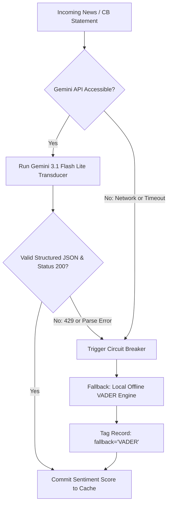

# DEUS PLATFORM: SYSTEM INTEGRITY, RELIABILITY, AND AI GOVERNANCE SPECIFICATION

---

## 1. Overview and Scope

This document specifies the engineering safeguards, data governance protocols, failure recovery models, and AI integration boundaries implemented within the **Deus Platform**.

Because algorithmic macro systems make directional capital decisions based on external statistical inputs, system governance is organized around three pillars:
1. **Mathematical & Data Integrity:** Strict point-in-time constraints, zero lookahead bias, and frequency-aware normalization.
2. **AI Model Governance:** Controlled LLM operational bounds, quota management, and deterministic offline fallbacks.
3. **Storage & Execution Resilience:** ACID transactions via SQLite WAL mode, atomic filesystem persistence, and process-level fault containment.

---

## 2. AI Governance and Sentiment Architecture

### 2.1. LLM Model Selection & Quota Engineering
The system utilizes Google Gemini models for semantic parsing of central bank press releases, policy meeting minutes, and economic news feeds.
- **Production Engine:** `gemini-3.1-flash-lite` (via official Google GenAI REST interface).
- **Rationale:** Free-tier audit of Google AI Studio revealed severe regional constraints on older models (such as `gemini-2.5-flash` capped at 20 requests/day, precipitating frequent HTTP 429 exceptions). The `gemini-3.1-flash-lite` architecture provides an operational threshold of 1,500 requests/day, ensuring continuous ingestion without API throttling.
- **Credential Storage:** Stored exclusively in the system environment as `GEMINI_API_KEY`.

### 2.2. Prompt Isolation and Bounded Transduction
To eliminate prompt injection risks and unpredictable model hallucinations:
- **Zero Execution Rights:** The model cannot execute code, make SQL queries, or access operating system primitives.
- **Strict Scalar Output:** The model operates strictly as a text-to-score transducer. Prompts enforce structured JSON schemas returning bounded scores:

$$\text{Sentiment Score} \in [-1.0, +1.0]$$

$$\text{Confidence Factor} \in [0.0, 1.0]$$

- Any output deviating from the strict JSON schema or exceeding numerical bounds is automatically rejected and routed to the fallback engine.

### 2.3. Dual-Engine Circuit Breaker (VADER Fallback)
The sentiment pipeline features an automated circuit breaker protecting against upstream API outages:



1. If the Gemini API returns HTTP 429, HTTP 503, or connection timeout $\ge 10\text{ seconds}$, the circuit breaker opens.
2. Execution immediately transfers to the local rule-based **VADER** (Valence Aware Dictionary and Sentiment Reasoner) engine augmented with domain-specific macroeconomic dictionaries.
3. The fallback score is recorded in `data/cache/` with the metadata flag `fallback: "VADER"`, ensuring deterministic pipeline completion and full audit traceability.

### 2.4. Interactive Macro QA & Grounded Reflection Engine
The web interface features an interactive quantitative macro assistant (`/api/deus/qa` invoking `packages/deus-engine/runners/runner_qa.py`) for querying system state, regime factors, and active divergence signals. To prevent generative hallucinations and preserve analytical determinism:
- **Deterministic Context Grounding:** Every user query is automatically prepended with a deterministic serialized JSON context payload extracted directly from SQLite (`deus.db WAL`), including active session run metadata, current Markov regime score/label, VIX & HY OAS readings, G8 currency composite scores with factor breakdowns, and active 28-pair FX signal differentials.
- **Strict Anti-Hallucination Prompt Architecture:** System instructions constrain Gemini 3.1 Flash Lite to act strictly as an analytical reflector. The model is forbidden from fabricating hypothetical macroeconomic data, extrapolating ungrounded policy assumptions, or contradicting calculated engine metrics. All assertions must cite explicit database values.
- **Zero-Privilege Read Isolation:** The QA runner operates in an isolated subprocess with zero write permissions to the database or filesystem. User queries cannot mutate system state or execute code.
- **Timeout and Fallback Guardrails:** Subprocess execution enforces a strict 30-second timeout. If the Gemini API is unresponsive or rate-limited, the runner returns an error status with diagnostic reasoning rather than hanging the web interface.

---

## 3. Data Integrity and Point-in-Time Assurance

### 3.1. Elimination of Lookahead Bias
Macroeconomic data is published with non-trivial reporting lags. To prevent lookahead contamination during backtesting and live calculations:
- **OECD Leading Indicators (CLI):** Explicit $\text{shift}(1)$ applied prior to normalization, mirroring real-world publication where month $T$ data is released mid-month $T+1$.
- **FRED High Yield Spreads:** Explicit $\text{shift}(1)$ applied to daily credit spread series to account for overnight publication latency.
- **Point-in-Time Parquet Caches:** Parquet cache files are indexed strictly by publication date ($T_{\text{pub}}$) rather than statistical observation period ($T_{\text{obs}}$).

### 3.2. Adaptive Rolling Window Normalization
Macroeconomic series have heterogeneous update intervals (daily, monthly, quarterly). Applying a uniform trading-day window introduces severe sample distortions:

| Data Frequency | Update Interval | Rolling Window ($w$) | Minimum Sample Count |
|---|---|---|:---:|
| **Daily** | $\le 20 \text{ days}$ | 180 trading days | 180 |
| **Monthly** | $21 \text{ to } 60 \text{ days}$ | 24 months | 24 |
| **Quarterly** | $> 60 \text{ days}$ | 8 quarters | 8 |

**Dual-Window Cold-Start Protocol:**
When a time series is initialized or has insufficient historical depth, a fast window calculates initial statistics, while missing slow-window data is populated via an expanding-window fillna mechanism. This guarantees no $\text{NaN}$ propagation while strictly preventing future data leakage.

---

## 4. Database Concurrency and Storage Reliability

### 4.1. SQLite Write-Ahead Logging (WAL) Architecture
System state, session executions, and historical signals are maintained in SQLite 3 (`data/deus.db`). The database connection is initialized with explicit reliability pragmas:

```sql
PRAGMA journal_mode = WAL;
PRAGMA synchronous = NORMAL;
PRAGMA busy_timeout = 15000;
PRAGMA foreign_keys = ON;
```

**Architectural Guarantees:**
- **Concurrent Non-Blocking Readers:** Analytical queries from the Telegram bot and Web Dashboard read snapshot states concurrently without blocking batch pipeline writes.
- **Lock Contention Mitigation:** `PRAGMA busy_timeout = 15000;` instructs the SQLite engine to wait up to 15 seconds during table locks before throwing operational errors.
- **Transactional Atomic Unit:** Signal generations are committed inside a `BEGIN IMMEDIATE ... COMMIT` block. If an unhandled exception occurs mid-run, the transaction is fully rolled back, preventing corrupted or partial session states.

### 4.2. Atomic File Persistence Protocol
Updates to configuration files, manual alpha stores (`data/manual_alpha.json`), and manual yields (`data/manual_yields.json`) must survive process crashes and power interruptions. The system enforces an atomic double-buffered swap protocol:

```
[ New In-Memory State ]
          │
          ▼
[ Write to <filename>.tmp ] ──► [ fsync() to Disk ]
                                        │
                                        ▼
[ Backup: <filename> ──► <filename>.bak ]
                                        │
                                        ▼
[ Atomic POSIX Rename: <filename>.tmp ──► <filename> ]
```

```python
import os
import json
from pathlib import Path

def atomic_json_save(target_path: Path, data: dict) -> None:
    temp_path = target_path.with_suffix(".tmp")
    bak_path = target_path.with_suffix(".bak")
    
    with open(temp_path, "w", encoding="utf-8") as f:
        json.dump(data, f, indent=2, ensure_ascii=False)
        f.flush()
        os.fsync(f.fileno())
        
    if target_path.exists():
        target_path.replace(bak_path)
        
    temp_path.replace(target_path)
```

---

## 5. System Failure Recovery Matrix

| Component | Failure Mode | Impact | Automated Recovery Action |
|---|---|---|---|
| **FRED API Connector** | HTTP 429 / HTTP 500 / Network Timeout | High (Monetary indicators missing) | Fallback to latest valid Parquet snapshot in `data/cache/`. Pipeline logs warning. |
| **Yahoo Finance Connector** | Throttling / Rate-Limit | High (Market prices missing) | Fallback to most recent close in SQLite database; if stale > 3 days, abort execution. |
| **SDMX Connectors (OECD / SNB)** | Schema change / 404 Table Error | Medium (Surprise / Deposit alpha missing) | Graceful omission: dynamic factor weights automatically rebalance across available metrics. |
| **Telegram Bot Service** | Network connection dropped | Low (Alert delivery delayed) | Python-telegram-bot auto-reconnects with exponential backoff; no pipeline disruption. |
| **Operating System** | Out of Memory (OOM) | Critical (Process terminated) | Container memory ceiling set to 2048M with 512M reservation. SQLite WAL auto-recovers on reboot. |

---

## 6. Sanitization and Secret Protection Standards

1. **Zero Secret Leakage:** No plaintext credentials, private tokens, or Telegram channel IDs are stored in source code, configuration YAMLs, or markdown files.
2. **Environment Variable Whitelist:**
   - `FRED_API_KEY`: St. Louis Fed API authorization.
   - `GEMINI_API_KEY`: Google GenAI API key.
   - `TELEGRAM_BOT_TOKEN`: Bot authentication token.
   - `ALLOWED_TELEGRAM_USERS`: Comma-separated integer IDs for access control.
3. **Path Portability:** All file path references are resolved dynamically using `pathlib.Path` relative to the project root directory. Local host filesystem paths (e.g. `C:\Users\...`) are strictly prohibited in code and documentation.

---

## 7. Related Technical Specifications

- [Project Abstract & Architecture Overview](README.md)
- [System Architecture Specification](ARCHITECTURE.md)
- [Data Processing & Scoring Methodology](PROJECT_OVERVIEW.md)

