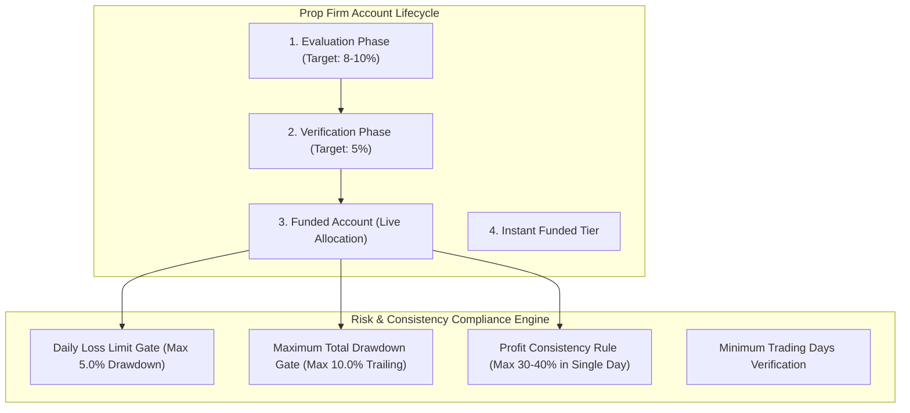

# DEUS PLATFORM: QUANTITATIVE MACRO METHODOLOGY & EXECUTION ANALYTICS SPECIFICATION

---

## 1. Quantitative Methodology and Economic Premise

The **Deus Platform** operates on the empirical foundation that medium- to long-term exchange rate trajectories across sovereign currency issuers are governed by persistent relative macroeconomic divergences. While high-frequency market order flow and microstructural noise dominate intra-day pricing, multi-week cross-sectional trends reflect structural differentials across four primary pillars:
1. **Real Yield Differentials & Policy Divergence:** Capital moves toward sovereign issuers offering higher risk-adjusted real yields and forward monetary tightening expectations.
2. **Comparative Business Cycle Acceleration:** Divergences in leading economic indicators (manufacturing and services PMIs, GDP revisions, labor market momentum) dictate capital expenditure and portfolio investment flows.
3. **Relative Inflation Persistence & Stagflation Vulnerability:** Inflation acceleration initially drives rate expectations higher, but late-cycle inflation combined with deteriorating growth induces severe stagflation penalties.
4. **Sovereign Terms of Trade & Commodity Price Shocks:** Net commodity exporters (CAD, AUD, NZD) benefit from positive terms-of-trade shocks, while net energy and raw material importers (JPY, EUR) suffer currency depreciation under rising commodity costs.

The platform continuously transforms heterogeneous time series into standardized directional momentum vectors, calculating cross-asset differentials across all 28 combinatorial currency pairs in the G8 economic area.

---

## 2. Factor Architecture and Macro Attribution

Each of the 8 currencies (USD, EUR, GBP, JPY, CHF, AUD, CAD, NZD) is assigned a dynamic composite score synthesized from 5 orthogonal factor clusters:

```
                      Composite Score (Single Currency)
                                       │
        ┌──────────────────────────────┼──────────────────────────────┐
        ▼                              ▼                              ▼
Monetary Cluster (37.5%)      Growth Cluster (29.0%)     Inflation Cluster (25.0%)
• Central Bank Policy Rate    • Services PMI             • Headline CPI YoY
• 10Y Real Sovereign Yield    • Manufacturing Flash PMI  • Core PCE (USD)
• 10Y-2Y Yield Curve Slope    • GDP Surprise Index       • Target Deviation
• 12M Market Rate Expect.     • Sahm Rule Momentum       • Stagflation Dampener
                                       │
                       ┌───────────────┴───────────────┐
                       ▼                               ▼
           Terms of Trade (Dynamic)          Alpha / Surprises (8.3%)
           • Energy (WTI, Brent, Gas)        • Citi Economic Surprise (CESI)
           • Industrial Metals (Copper, Fe)  • SNB Sight Deposit Outflows
           • Agricultural Basket (Wheat, GDT)• CFTC Speculative Net Sentiment
```

### 2.1. Factor Definitions and Transmission Mechanics

| Factor Cluster | Base Weight | Core Indicators | Transmission Mechanism |
|---|:---:|---|---|
| **Monetary Policy** | **37.5%** | Policy Rate, 10Y Real Yield, 10Y-2Y Curve Slope, 12M Expectations | Capital allocates toward higher risk-adjusted real yields; yield curve slope signals expansionary versus contractionary phases. |
| **Growth / Demand** | **29.0%** | Markit/S&P Global PMIs, GDP Surprises, Sahm Rule | Accelerating domestic demand attracts direct and portfolio flows; rising unemployment momentum flags policy easing cycles. |
| **Inflation Dynamics** | **25.0%** | Headline CPI YoY, Core PCE, Inflation Target Gap | Inflation acceleration supports currency via rate hike expectations; late-cycle stagflation triggers variance penalties. |
| **Terms of Trade** | **Dynamic** | WTI, Brent, TTF Gas, Henry Hub, Copper, Iron Ore, Wheat | Net commodity exporters (CAD, AUD, NZD) benefit from positive terms-of-trade shocks; net energy importers (JPY, EUR) experience negative terms of trade. |
| **Alpha & Surprises** | **8.3%** | Citi Economic Surprise (CESI), SNB Sight Deposits, CFTC COT | Quantifies consensus forecasting errors, tracking central bank FX intervention flows and extreme positioning imbalances. |

### 2.2. Mathematical Aggregation & Variance Penalty
The raw composite score for currency $c$ is computed as:

$$\text{Composite}_c = \frac{\sum_{i=1}^M w_i(t) \cdot Z_{i,c}(t)}{\sum_{i=1}^M |w_i(t)|} \times \text{VP}_c(t)$$

where $\text{VP}_c(t)$ is the **Variance Penalty** dampener:

$$\text{VP}_c(t) = \frac{1}{1 + \lambda \cdot \text{Var}\left(\{Z_{i,c}(t)\}_{i=1}^M\right)}, \quad \lambda = 0.15$$

When individual factor indicators within a currency point in conflicting directions (high variance), $\text{VP}_c$ automatically suppresses the composite score toward zero, preventing low-conviction or internally contradictory signals from triggering active allocations.

### 2.3. Dynamic Business Cycle Blender & Stagflation Filter
Factor weights $w_i(t)$ adapt based on the business cycle stage identified by the `CycleBlender` module:
- **Expansion:** Growth and terms-of-trade weights are elevated; real yield carry is maximized.
- **Slowdown:** Inflation persistence and monetary policy receive higher allocation.
- **Contraction:** Real yield spreads and sovereign safe-haven flows dominate.
- **Recovery:** Leading PMI momentum and commodity sensitivity are magnified.

#### Stagflation Filter Protocol
If 3-month momentum of Headline CPI accelerates ($Z_{\text{CPI}} > 0.0$) while Manufacturing PMI contracts ($Z_{\text{PMI}} < -0.5$), the system identifies stagflation dynamics:

$$w_{\text{Inflation}}^{\text{adjusted}} = w_{\text{Inflation}} \times 0.50$$

$$w_{\text{Growth}}^{\text{adjusted}} = w_{\text{Growth}} \times 1.50$$

This rebalancing dampens the artificial bullishness of rate hike expectations during supply-side economic contractions.

---

## 3. Multi-Frequency Rolling Z-Score Normalization

Every macroeconomic series $X$ is normalized using a point-in-time rolling window $w$:

$$\mu_{w,t} = \frac{1}{w} \sum_{k=0}^{w-1} X_{t-k}$$

$$\sigma_{w,t} = \sqrt{\frac{1}{w-1} \sum_{k=0}^{w-1} \left(X_{t-k} - \mu_{w,t}\right)^2}$$

$$Z_t = \text{clip}\left(\frac{X_t - \mu_{w,t}}{\sigma_{w,t}}, -3.0, +3.0\right)$$

To reconcile disparate sampling intervals across economic indicators without lookahead leakage, the rolling statistical window $w$ scales dynamically based on the observed data frequency:
- **Daily Series** (Benchmark yields, volatility indices, market exchange rates): $w = 180 \text{ trading days}$.
- **Monthly Series** (Central Bank policy rates, CPI YoY, PMIs, unemployment): $w = \max(24, \lfloor 180 / 30 \rfloor) = 24 \text{ months}$.
- **Quarterly Series** (Sovereign GDP, quarterly CPI releases): $w = \max(8, \lfloor 180 / 91 \rfloor) = 8 \text{ quarters}$.

### Dual-Window Cold-Start Protocol
When series history is insufficient for the full slow window, a dual-window hybrid mechanism replaces missing slow statistics with fast-window estimates ($\text{fillna}$), preventing $\text{NaN}$ propagation while strictly preventing forward data leakage.

---

## 4. 28-Pair Cross-Sectional Combinatorial Matrix

The evaluation universe comprises all $C(8, 2) = 28$ combinatorial currency pairs derived from the G8 currency set:

$$M_{i,j} = \text{Score}_i - \text{Score}_j \quad \forall i < j$$

### 4.1. Polarity and Direction Inversion
- **Positive Divergence:** $\text{Score}_A > 0 \land \text{Score}_B < 0 \land \Delta_{A/B} \ge +1.5\sigma$.
- **Negative Divergence:** $\text{Score}_A < 0 \land \text{Score}_B > 0 \land \Delta_{A/B} \le -1.5\sigma$.
- If market conventions quote the inverse pair ($B/A$ instead of $A/B$), the signal direction is inverted:

$$\text{Signal}_{\text{Canonical}} = -\Delta_{A/B}$$

### 4.2. Signal Lifecycle & State Evolution
1. **Trigger Condition:** $|\Delta_{A/B}| \ge 1.5\sigma$.
2. **Temporal Stability Gate:** Divergence must persist across $\ge 3$ consecutive daily calculation cycles.
3. **Active State:** Divergence is published to the web dashboard and Telegram alert stream. Average holding duration is **16.1 trading days**.
4. **Deactivation Triggers:**
   - **Decay:** $|\Delta_{A/B}| < 1.5\sigma$.
   - **Polarity Reversal:** $\text{Score}_A \le 0 \lor \text{Score}_B \ge 0$.
   - **Lifecycle Horizon:** Max holding cap of 63 trading days.

---

## 5. Out-of-Sample (OOS 2023–2026) Statistical Verification

The scoring engine is calibrated across historical datasets using walk-forward parameter verification (2018–2022 baseline) and validated against Out-of-Sample datasets (2023–2026) under strict zero-lookahead conditions:
- **Out-of-Sample FX Directional Accuracy:** **68.9%** across $N = 161$ validated signal intervals.

### 5.1. High-Confidence Statistical Cohort ($N \ge 10$)
Pairs with sufficient historical observation density and statistically robust directional hit rates:

| Currency Pair | Sample Count ($N$) | Directional Accuracy (%) | Average Persistence (Days) | Market Identifier | Operational Status |
|---|:---:|:---:|:---:|:---:|:---:|
| **EUR/JPY** | 10 | **90.00%** | 21.6 | `EURJPY=X` | Active |
| **NZD/JPY** | 14 | **78.57%** | 29.0 | `NZDJPY=X` | Active |
| **AUD/CHF** | 13 | **76.92%** | 17.2 | `AUDCHF=X` | Active |
| **AUD/JPY** | 12 | **75.00%** | 27.7 | `AUDJPY=X` | Active |
| **CAD/JPY** | 15 | **73.33%** | 28.3 | `CADJPY=X` | Active |
| **NZD/USD** | 25 | **64.00%** | 4.3 | `NZDUSD=X` | Active |
| **GBP/USD** | 11 | **63.64%** | 5.5 | `GBPUSD=X` | Active |
| **AUD/USD** | 16 | **62.50%** | 5.0 | `AUDUSD=X` | Active |
| **GBP/JPY** | 10 | **60.00%** | 29.8 | `GBPJPY=X` | Active |
| **GBP/CHF** | 17 | **58.82%** | 17.6 | `GBPCHF=X` | Active |
| **USD/JPY** | 12 | **50.00%** | 4.0 | `USDJPY=X` | Active |
| **USD/CAD** | 20 | **50.00%** | 3.2 | `USDCAD=X` | Active |

### 5.2. Structural Divergence Anomaly Cohort (Systematically Excluded)
Pairs exhibiting negative predictive correlation or persistent fundamental decoupling due to sovereign intervention boundaries or localized non-market constraints:

| Currency Pair | Sample Count ($N$) | Directional Accuracy (%) | Primary Structural Exclusion Factor |
|---|:---:|:---:|---|
| **CAD/CHF** | 29 | 44.83% | Structural breakdown in commodity cross-hedging. |
| **NZD/CHF** | 22 | 54.55% | Multi-week momentum failure and erratic carry unwind. |
| **EUR/CHF** | 8 | 37.50% | Central bank currency intervention boundaries (SNB). |
| **USD/CHF** | 5 | 40.00% | Structural safe-haven flight inversions. |

### 5.3. Low-Data Sample Cohort ($N < 10$)
Pairs with insufficient signal triggers during the OOS testing window (suspended from live routing):
`EUR/CAD` ($N=9$), `EUR/NZD` ($N=5$), `EUR/AUD` ($N=2$), `EUR/GBP` ($N=2$), `CAD/NZD` ($N=2$), `GBP/CAD` ($N=2$), `AUD/CAD` ($N=2$), `CHF/JPY` ($N=2$), `AUD/NZD` ($N=1$), `USD/EUR` ($N=1$), `GBP/AUD` ($N=0$), `GBP/NZD` ($N=0$).

### 5.4. Global Equity Index Multi-Factor Verification
The independent equity index pipeline monitors 4 benchmark indices via OECD CLI momentum, yield curve slope, and high-yield credit spreads:

| Index | Base Currency | Market Identifier | Out-of-Sample ($N$) | Directional Accuracy (%) | Model Robustness |
|---|---|---|:---:|:---:|:---:|
| **SP500** | USD | `^GSPC` | 18 | **88.9%** | Robust |
| **US30** | USD | `^DJI` | 18 | **72.2%** | Robust |
| **DAX40** | EUR | `^GDAXI` | 17 | **58.8%** | Moderate |
| **ASXAUD** | AUD | `^AXJO` | 15 | **73.3%** | Robust |

*Combined Out-of-Sample Equity Accuracy demonstrates **73.5% hit rate** ($N = 68$).*

---

## 6. Risk-Adjusted Position Sizing & Prop Firm Consistency Tracking

Statistical edge can be completely eroded by uncontrolled position sizing or abrupt drawdowns. The platform integrates a quantitative position sizing engine with institutional prop firm consistency tracking.

### 6.1. Volatility-Adjusted Multi-Asset Position Sizing

For currency crosses, position sizing adapts to current market volatility via the Average True Range ($\text{ATR}_{14}$):

$$\text{Position Size (Lots)} = \frac{\text{Risk Target (USD)}}{\text{ATR}_{\text{pips}} \times M_{\text{macro}} \times \text{Pip Value}_{\text{lot}}}$$

where:
- $\text{Risk Target}$: Fixed capital allocation (e.g., $1.0\%$ or $0.5\%$ of account equity).
- $\text{ATR}_{\text{pips}}$: 14-day daily Average True Range converted to pips ($0.0001$ standard, $0.01$ JPY).
- $M_{\text{macro}}$: Volatility multiplier (typically $1.5\times$ to $2.5\times$ daily ATR) providing breathing room for multi-week macroeconomic trends against intra-day stop hunts.
- $\text{Pip Value}_{\text{lot}}$: Exact USD pip value per standard lot ($100,000$ base units), converted via cross rates for non-USD quotes.

#### Equity Index CFD Contract Sizing
For benchmark equity indices:

$$\text{Contracts} = \frac{\text{Risk Target (USD)}}{\text{ATR}_{\text{points}} \times M_{\text{macro}} \times \text{Point Value}_{\text{USD}}}$$

### 6.2. Prop Firm Challenge & Consistency Tracking

The web application's Prop Firm Tracker (`apps/web/src/components/prop-firm-tracker.tsx`, `apps/web/src/lib/prop-firms.ts`) bridges macroeconomic signal generation with prop firm risk compliance rules:



1. **Daily Loss Limit Safeguard ($D_{\text{loss}} \le 5\%$):** Tracks daily realized and floating equity swings from the daily opening balance. Alerts trigger if floating exposure approaches $3.5\%$ daily loss, enforcing an emergency de-risking circuit breaker before the hard $5\%$ rule is breached.
2. **Maximum Trailing Drawdown ($MDD \le 10\%$):** Real-time equity high-water mark tracking preventing account breach.
3. **Profit Consistency Rule Engine:** Leading institutional prop firms require traders to avoid single-event gambling spikes:

$$\text{Consistency Ratio} = \frac{\max_{t}(\text{Daily Profit}_t)}{\sum_{t} \text{Daily Profit}_t} \le 35\%$$

The tracking engine evaluates historical trade journals, warning traders when single-trade or single-day gains violate consistency guidelines.

---

## 7. Specifications Reference

- [Project Abstract & Architecture Overview](README.md)
- [System Architecture Specification](ARCHITECTURE.md)
- [System Integrity & AI Governance](GOVERNANCE_AND_RELIABILITY.md)
