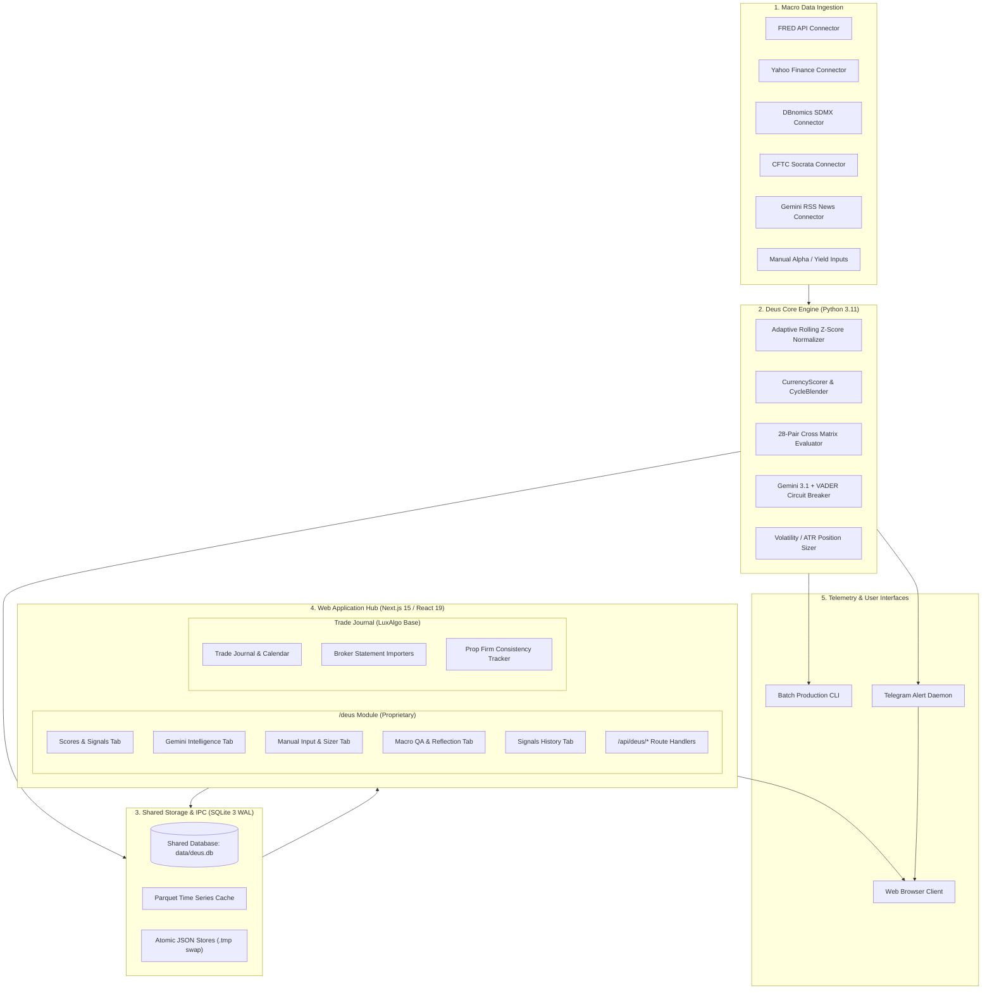

# DEUS PLATFORM: QUANTITATIVE MACRO ORACLE & EXECUTION ANALYTICS ECOSYSTEM

[]()
[]()
[-black.svg)]()
[]()
[]()
[]()
[]()
[]()

---

> [!NOTE]
> **Repository Scope & Architectural Showcase**:  
> This repository serves as a **System Architecture & Quantitative Design Specifications Showcase** presenting the end-to-end integration of the **Deus Platform**. The ecosystem combines the high-performance Python **Deus Core** quantitative macro engine, the **Next.js 15 / React 19 / TypeScript** web hub featuring the institutional `/deus` macro intelligence module, and the adapted **LuxAlgo open-source Trade Journal** foundation.  
> Production runtime models, private algorithmic parameters, live automated execution connectors, and institutional access tokens are maintained in an enterprise private monorepo.

---

## Documentation Suite & Specifications

| Document | Scope & Focus | Standards / Conventions |
|---|---|---|
| [System Architecture Specification](ARCHITECTURE.md) | Monorepo component topology (`apps/web` + `packages/deus-engine`), IPC via shared SQLite WAL, `/deus` Web API endpoints, UI state flows, security & environment boundaries. | IEEE 1016 SDD |
| [Data Processing & Scoring Methodology](PROJECT_OVERVIEW.md) | Quantitative methodology, rolling Z-score normalizer, 5 macro factor clusters, 28-pair cross-sectional matrix, OOS 2023–2026 statistical verification (68.9% directional accuracy), risk-adjusted position sizing & prop firm consistency tracking. | Quantitative Research / Empirical Validation |
| [System Integrity & AI Governance](GOVERNANCE_AND_RELIABILITY.md) | AI governance protocols (Google Gemini 3.1 Flash Lite bounded scalar transduction $[-1.0, +1.0]$, deterministic offline VADER circuit breaker), interactive Macro QA / reflection engine, and multi-process SQLite WAL concurrency guarantees. | AI Safety / Data Governance / Systems Reliability |

---

## 1. System Abstract & Platform Ecosystem

The **Deus Platform** is an enterprise-grade quantitative macroeconomic oracle and execution analytics ecosystem. It bridges statistical macro signal generation with institutional trade journaling and risk compliance tracking across the G8 economic area (USD, EUR, GBP, JPY, CHF, AUD, CAD, NZD) and benchmark equity indices (SP500, US30, DAX40, ASXAUD).

The platform operates across three interconnected layers:
1. **Quantitative Macro Engine (`packages/deus-engine`)**: A vectorized Python signal processing pipeline that continuously ingests macroeconomic indicators, normalizes heterogeneous time series via frequency-adaptive rolling Z-scores, projects momentum across dynamic business cycles, and calculates cross-asset differentials across all 28 combinatorial currency crosses.
2. **Institutional Web Hub (`apps/web` - Next.js 15 / React 19 / TypeScript)**: A full-stack web application hosting the dedicated `/deus` intelligence module. The web hub provides interactive real-time scorecards, cross-pair divergence matrices, central bank policy sentiment feeds, an ATR-based position sizer, and a grounded Macro QA reflection assistant.
3. **Execution Analytics & Trade Journal Foundation**: Adapted from the open-source LuxAlgo Trade Journal (MIT), this subsystem manages multi-account trade logging, broker statement imports (TradeLocker, MetaTrader 4/5, cTrader, Interactive Brokers), execution replay, and prop firm consistency tracking.

---

## 2. Component Provenance & Attribution Matrix

In strict adherence to intellectual property transparency and open-source licensing standards, the platform clearly delineates proprietary quantitative engineering from open-source foundational components:

| Component Category | Subsystem / Module | Ownership & Attribution | Description & License |
|---|---|---|---|
| **Quantitative Core** | `packages/deus-engine`<br>`modules/` | **Proprietary Engineering** | Automated macro ingestion, frequency-adaptive rolling Z-score normalizer, dynamic business cycle blender, stagflation dampener, and 28-pair matrix evaluator. |
| **AI Governance & NLP** | `modules/data_ingestion/`<br>`runners/runner_gemini_rss.py`<br>`runners/runner_qa.py` | **Proprietary Engineering** | Google Gemini 3.1 Flash Lite bounded scalar transducer ($[-1.0, +1.0]$), deterministic offline VADER circuit breaker, and interactive Macro QA reflection engine. |
| **Telemetry & Services** | `scripts/telegram_bot.py`<br>`runners/` | **Proprietary Engineering** | Multi-threaded asynchronous Telegram alerting daemon, automated daily report formatters, and CLI execution tools. |
| **Web Macro Intelligence** | `apps/web/src/app/deus/`<br>`apps/web/src/components/deus/`<br>`apps/web/src/server/deus.ts` | **Proprietary Engineering** | Custom Next.js 15 / React 19 institutional interface: Scores & Signals, Gemini Intelligence, Manual Indicator Loader, Macro QA, and Signals History. |
| **Risk & Position Sizing** | `packages/deus-engine/scripts/position_sizer.py`<br>`components/deus/manual-sizer-tab.tsx` | **Proprietary Engineering** | Volatility/ATR-based multi-asset position sizing engine, CFD index contract multipliers, and prop firm risk boundary calculators. |
| **Trade Journal Base** | `apps/web/src/app/journal/`<br>`apps/web/src/app/trades/`<br>`apps/web/src/app/calendar/` | **Open-Source Foundation** | Core trade logging, calendar views, analytics dashboards, and UI layouts adapted from the **LuxAlgo open-source Trade Journal** (MIT License). |
| **Broker Statement Parsers** | `packages/importers/` | **Open-Source Foundation** | Multi-broker statement parsers for TradeLocker, MT4, MT5, cTrader, and CSV reports adapted from LuxAlgo open-source Trade Journal (MIT License). |
| **Execution Visualization** | `packages/core/`<br>`@luxalgo/vela` | **Open-Source Foundation** | Chart replay modules, candlestick rendering utilities, and base trade models adapted from LuxAlgo open-source Trade Journal (MIT License). |

---

## 3. Monorepo Architecture Topology

The platform enforces clean separation of concerns and unidirectional data flows across its monorepo packages and applications:



---

## 4. Quantitative Methodology Highlights

### 4.1. Multi-Frequency Rolling Z-Score Normalization
Every raw macroeconomic metric $X$ is converted to a normalized point-in-time Z-score bounded to eliminate extreme outlier distortions:

$$Z_t = \text{clip}\left(\frac{X_t - \mu_{w,t}}{\sigma_{w,t}}, -3.0, +3.0\right)$$

To reconcile disparate sampling intervals across economic indicators without forward-looking data leakage:
- **Daily Series** (Benchmark yields, volatility indices, market exchange rates): $w = 180 \text{ trading days}$.
- **Monthly Series** (Central Bank policy rates, CPI YoY, PMIs, unemployment): $w = \max(24, \lfloor 180 / 30 \rfloor) = 24 \text{ months}$.
- **Quarterly Series** (Sovereign GDP, quarterly CPI releases): $w = \max(8, \lfloor 180 / 91 \rfloor) = 8 \text{ quarters}$.

### 4.2. Currency Composite Scoring and Dynamic Cycle Blending
The composite score for each G8 currency is computed as a dynamically normalized weighted sum across 5 macro factor clusters:

$$\text{Score}_{\text{currency}} = \frac{\sum_{i=1}^M w_i \cdot Z_i}{\sum_{i=1}^M |w_i|} \times \text{VP}$$

where $\text{VP}$ is the internal variance penalty dampener:

$$\text{VP} = \frac{1}{1 + \lambda \cdot \text{Var}\left(\{Z_i\}_{i=1}^M\right)}, \quad \lambda = 0.15$$

Factor weights $w_i$ adapt dynamically based on the macroeconomic cycle stage (Expansion, Slowdown, Contraction, Recovery) determined by the `CycleBlender` module:
- **Monetary Policy** (base weight ~37.5%): Central bank policy rates, 10Y real yields, 10Y-2Y yield curve slope, 12M rate expectations.
- **Economic Growth / PMI** (base weight ~29.0%): Services PMI, Manufacturing Flash PMI, GDP surprise indices, Sahm Rule momentum.
- **Inflation Dynamics** (base weight ~25.0%): CPI YoY, core PCE, target deviation with stagflation dampening.
- **Terms of Trade & Commodities** (dynamic weights): WTI crude oil, natural gas, copper, iron ore, agricultural export baskets.
- **Alpha & Surprises** (base weight ~8.3%): Citi Economic Surprise Index (CESI), SNB sight deposit flows, GDT dairy auction metrics.

### 4.3. Cross-Sectional Differential Matrix & Signal Evolution
Pairwise divergence between currencies $A$ and $B$ across all $C(8, 2) = 28$ crosses is calculated as:

$$\Delta_{A/B} = \text{Score}_A - \text{Score}_B$$

- **Divergence Threshold:** A statistically significant signal requires $|\Delta_{A/B}| \ge 1.5\sigma$.
- **Polarity Confirmation:** $\text{Score}_A > 0$ and $\text{Score}_B < 0$.
- **Temporal Persistence:** Divergence must hold continuously across $\ge 3$ consecutive daily calculation cycles.
- **Dynamic Deactivation:** Signal state deactivates when $|\Delta_{A/B}| < 1.5\sigma$, when polarities invert, or upon reaching the 63-day maximum horizon.

### 4.4. Risk-Adjusted Position Sizing & Prop Firm Consistency Tracking
To translate statistical macro signals into institutional risk-controlled execution, the platform provides an ATR-based position sizing engine:

$$\text{Position Size (Lots)} = \frac{\text{Risk Target (USD)}}{\text{ATR}_{\text{pips}} \times \text{Multiplier} \times \text{Pip Value}_{\text{lot}}}$$

The web hub's Prop Firm Tracker pairs this sizing model with strict consistency rules:
- **Daily Loss Boundary:** Halts exposure when daily account drawdown approaches the $5\%$ limit.
- **Maximum Drawdown Boundary:** Dynamic equity high-water mark tracking enforcing the $10\%$ total loss ceiling.
- **Profit Consistency Guardrails:** Enforces that no single trading day accounts for $> 30-40\%$ of cumulative profits, ensuring compliance with institutional prop firm verification mandates.

---

## 5. Statistical Validation & Quantitative Performance

The scoring engine is calibrated across historical datasets using walk-forward parameter verification (2018–2022 baseline) and validated against Out-of-Sample datasets (2023–2026) under strict zero-lookahead conditions:

- **Out-of-Sample FX Directional Accuracy:** **68.9%** across $N = 161$ validated signal intervals.
- **High-Confidence Cohort Accuracy:** Top-performing crosses include **EUR/JPY (90.0%)**, **NZD/JPY (78.6%)**, **AUD/CHF (76.9%)**, and **AUD/JPY (75.0%)**.
- **Average Active Duration:** **16.1 trading days**, capturing medium-term cyclical trends while avoiding microstructural market noise.
- **Equity Index Out-of-Sample Accuracy:** **73.5%** on Out-of-Sample data ($N = 68$) across SP500, US30, DAX40, and ASXAUD.
- **Zero-Lookahead Safeguards:** Automated 1-month lagging ($\text{shift}(1)$) applied to OECD CLI and overnight lag applied to Federal Reserve credit spread feeds.

---

## 6. AI Governance & Reliability Standards

1. **Bounded Scalar Transduction:** Google Gemini 3.1 Flash Lite (`gemini-3.1-flash-lite`) processes unstructured central bank statements and economic RSS news. Prompts enforce strict schema parsing returning scalar values bounded within $[-1.0, +1.0]$. The model possesses zero operating system execution privileges.
2. **Deterministic VADER Fallback:** If upstream API rate limits (HTTP 429), timeouts, or connectivity errors occur, an automated circuit breaker immediately routes scoring to an offline rule-based VADER engine equipped with domain-specific macroeconomic dictionaries. Fallbacks are tagged with `[FALLBACK: VADER]` in the SQLite audit log.
3. **Interactive Macro QA & Reflection:** The web hub provides a grounded Macro QA assistant that queries the SQLite database directly, passing real-time factor scores, regime parameters, and signal histories as deterministic context to eliminate hallucinations.
4. **Multi-Process SQLite Concurrency:** SQLite 3 is configured with Write-Ahead Logging (`WAL`), `synchronous = NORMAL`, and `busy_timeout = 15000`, enabling non-blocking concurrent reads by the Next.js web application and Telegram daemon while the Python batch pipeline writes updates.

---

## 7. Monorepo Structure

```text
Deus_Platform/
├── apps/
│   └── web/                               # Next.js 15 / React 19 / TypeScript Web Hub
│       ├── src/app/
│       │   ├── api/deus/                  # Macro engine API routes (scoring, gemini, qa, manual)
│       │   ├── deus/                      # Institutional Deus Intelligence dashboard (/deus)
│       │   ├── journal/                   # Trade Journal & trade log views (LuxAlgo base)
│       │   ├── prop-firms/                # Prop firm challenge & consistency tracker
│       │   ├── calendar/                  # Interactive trade calendar
│       │   └── trades/                    # Detailed trade performance analytics
│       ├── src/components/
│       │   ├── deus/                      # /deus tab components (scores, gemini, sizer, qa, history)
│       │   └── ui/                        # Radix UI and Tailwind CSS primitives
│       └── src/server/                    # Server-side engine runners, SQLite client, crypto utils
├── packages/
│   ├── core/                              # Shared trade models and calculation types (LuxAlgo base)
│   ├── deus-engine/                       # Proprietary Python Quantitative Macro Engine
│   │   ├── modules/                       # Ingestion, normalization, scoring, matrix, context
│   │   ├── runners/                       # Web hub IPC execution runners (scoring, gemini, qa)
│   │   ├── scripts/                       # CLI pipelines (live_run, index_run, position_sizer)
│   │   └── tests/                         # Pytest automated test suites
│   └── importers/                         # Broker statement parsers (MT4/5, TradeLocker, cTrader)
├── data/
│   ├── cache/                             # Downstream Parquet API cache
│   ├── deus.db                            # Shared SQLite persistence store (WAL mode)
│   ├── manual_alpha.json                  # Weekly manual alpha indicators
│   └── manual_yields.json                 # Weekly manual yields and rates
└── docs/                                  # Public documentation suite & IEEE 1016 specifications
```

---

## 8. CLI & Operational Run Contracts

### 8.1. Python Macro Engine Execution Contracts

```bash
# Execute standard daily batch FX pipeline
python packages/deus-engine/scripts/live_run.py

# Execute in dry-run mode (output to stdout without database modification)
python packages/deus-engine/scripts/live_run.py --dry-run

# Force refresh of external data connectors (bypassing Parquet cache)
python packages/deus-engine/scripts/live_run.py --force-refresh

# Execute daily equity index and commodity momentum evaluation
python packages/deus-engine/scripts/index_run.py

# Launch volatility and ATR-based multi-asset position sizer
python packages/deus-engine/scripts/position_sizer.py

# Start asynchronous Telegram alert and monitoring bot
python packages/deus-engine/scripts/telegram_bot.py
```

### 8.2. Web Application Hub Execution Contracts

```bash
# Install monorepo dependencies
pnpm install

# Start Next.js 15 development server with Turbopack (port 3005)
pnpm --filter web dev

# Compile production build
pnpm --filter web build

# Start production server
pnpm --filter web start
```

### 8.3. Automated Testing Suite

```bash
# Execute Python quantitative engine unit & regression tests
pytest packages/deus-engine/tests/

# Execute Next.js web application typecheck
pnpm --filter web typecheck
```

---

## 9. Specifications Reference

- [System Architecture Specification](ARCHITECTURE.md)
- [Data Processing & Scoring Methodology](PROJECT_OVERVIEW.md)
- [System Integrity & AI Governance](GOVERNANCE_AND_RELIABILITY.md)

---

## 10. License & Legal Attribution

- **Proprietary Core & Macro Intelligence**: Copyright © 2023–2026 Deus Platform Engineering. All rights reserved. Proprietary quantitative models, scoring algorithms, and `/deus` web modules.
- **Open-Source Trade Journal Foundation**: Adapted from the **LuxAlgo Trade Journal**, licensed under the **MIT License**. Broker statement parsers, trade calendar layouts, and chart replay components are distributed under MIT license terms.
